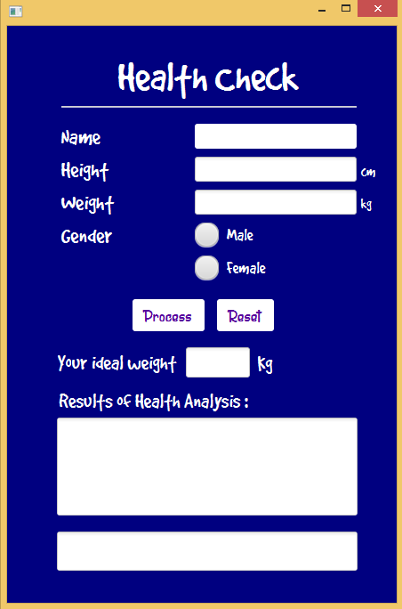
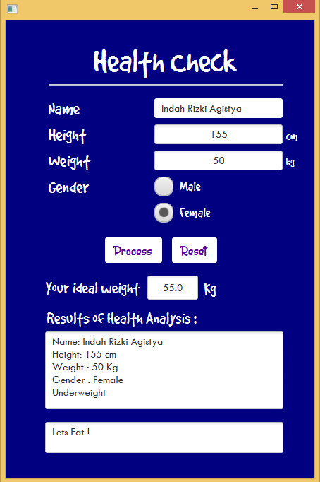
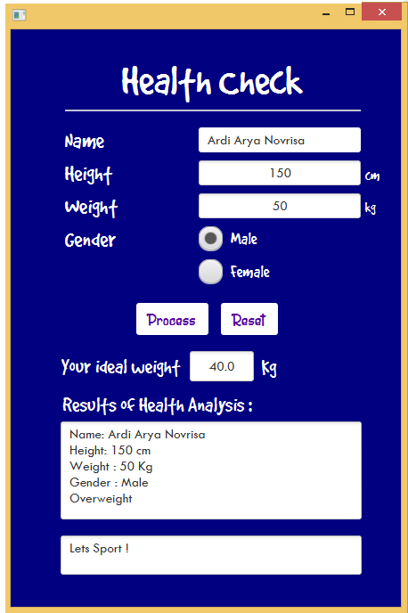

# KESEHATAN

AWAL

Deskripsi Program :

Program ini menjalankan hasil eksekusi dari inputan user. Eksekusi program ialah menampilkan data inputan dan menentukan user termasuk orang ideal / overweight / underweight. Program ini juga perhatian dengan memberikan saran kepada usernya.

PROSES

Perempuan

Deskripsi Program :

Pada eksekusi ini berat badan ideal user dihitung dengan cara mengurangi tinggi user dengan 100cm. Hal ini dikarenakan user bergender perempuan.

Laki-laki

Deskripsi Program :

Pada eksekusi ini berat badan ideal user dihitung dengan cara mengurangi tinggi user dengan 110cm. Hal ini dikarenakan user bergender laki-laki.

RESET

Deskripsi Program :

Pada eksekusi ini semua data inputan user dihilangkan. Data yang dihapus adalah data yang ada ditampilan maupun di inputan user yang telah diketik.

~ Sekian dari saya "TERIMAKASIH"

